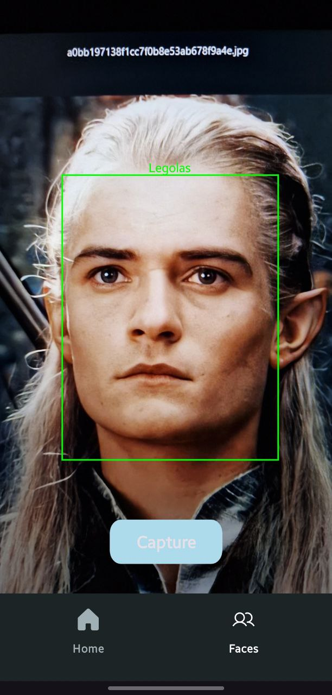
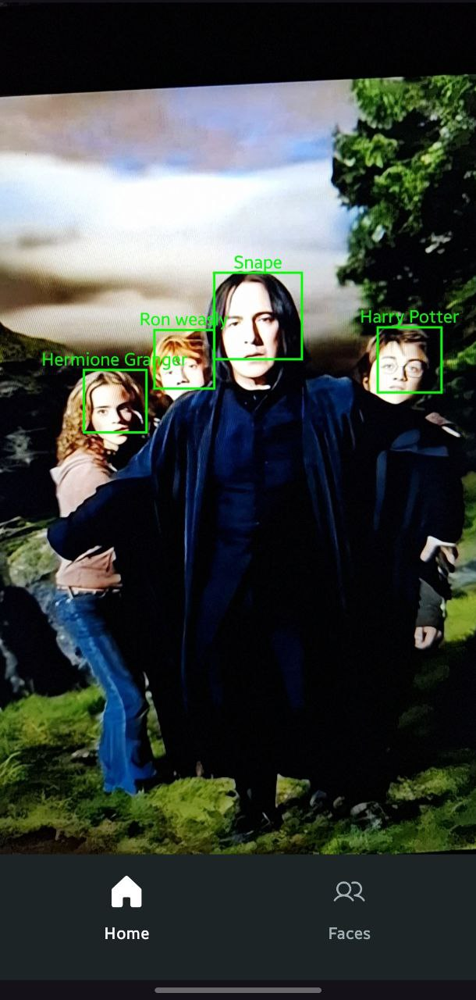
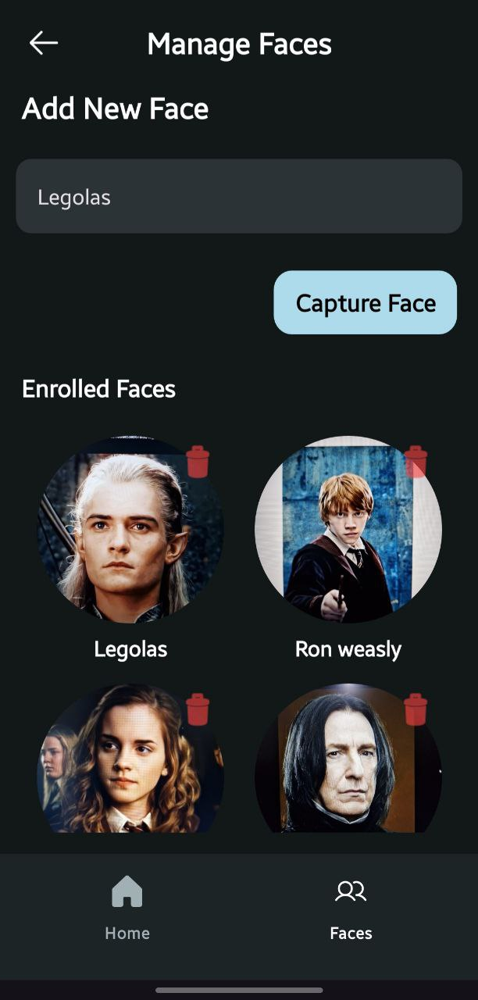

# Glimpse 📸

A privacy-first, on-device face recognition Android application built with Kotlin and modern Android development tools. Glimpse performs all processing locally, ensuring your data never leaves your device and the core functionality works entirely offline.

---

## 🚀 Overview

Glimpse performs real-time face recognition using the device's camera. The application is built around two key phases:

1.  **Enrollment:** A user can add a new person by taking their picture. The app detects the face, runs it through a **FaceNet** model to create a unique numerical "embedding," and saves this embedding locally with the person's name.
2.  **Recognition:** In the live camera view, the app continuously detects faces using **ML Kit**. For each face found, it calculates an embedding and compares it to the saved ones using **cosine similarity**. If a match is found above a confidence threshold, the name is displayed on screen.

## ✨ Features

-   **Real-time** face detection and recognition.
-   **On-Device Processing:** All face data and ML inference happen locally. No internet connection is required for core features.
-   **Privacy Focused:** User data is never sent to a server.
-   **Simple Enrollment:** Easily add new faces by capturing a photo.
-   **Camera Switching:** Seamlessly switch between front and back cameras.

## 🛠️ Tech Stack & Architecture

-   **Language:** [Kotlin](https://kotlinlang.org/)
-   **Platform:** Android
-   **Architecture:** MVVM (Model-View-ViewModel)
-   **Core Libraries:**
    -   **CameraX:** For a consistent and easy-to-use camera API.
    -   **TensorFlow Lite:** For running the on-device FaceNet model.
    -   **Google ML Kit (Vision API):** For high-performance, real-time face detection.
    -   **Room:** For local persistence of face embeddings and user data.
    -   **Jetpack Navigation:** For handling in-app navigation.

## ⚙️ How It Works

The recognition pipeline is powered by a combination of two machine learning models:

1.  **Face Detection (ML Kit):** First, we use the fast and accurate face detector from Google's ML Kit to locate faces in the camera frame.
2.  **Face Recognition (FaceNet):** Once a face is detected and cropped into a 160*160 pixels image, it is passed to **TensorFlow Lite FaceNet model**. This model outputs a **512-element float array**, known as an embedding, which serves as a unique numerical signature for that face.
3.  Source of the model 
https://github.com/timesler/facenet-pytorch
4.  **Comparison (Cosine Similarity):** To find a match, the embedding of a detected face is compared against all the enrolled embeddings stored in the Room database. We calculate the **cosine similarity** between the vectors to determine how "close" they are. If the similarity score exceeds a predefined threshold (e.g., `0.6`), the faces are considered a match.

## 📸 Screenshots

| Enrollment Screen | Recognition Screen | Stored Faces Screen
| :---------------: | :------------------: | :------------------: |
|   |    |  |

## 📦 Setup and Installation

1.  Clone the repository:
    ```sh
    git clone [https://github.com/YOUR_USERNAME/Glimpse.git](https://github.com/YOUR_USERNAME/Glimpse.git)
    ```
2.  Open the project in Android Studio.
3.  Let Gradle sync and download the required dependencies.
4.  Build and run the application on an Android device or emulator.
